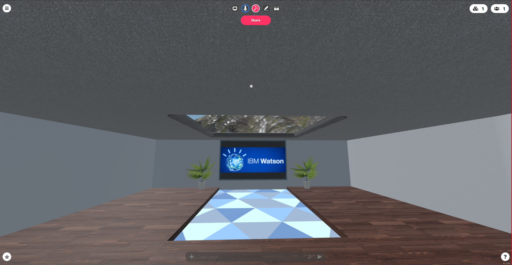

# BOH-Unsupervised
Birmingham open hack tech weekend

The purpose of this project was to create a 3d/VR digital collaborative environment, that allowed the user to be able meet, talk to others, explore and watch videos. The participants would be able to give or listen to lectures within the 3D/VR environment. The environment should be easy to use and have an enjoyable, entertaining, interactive and different atmosphere. The challenge of the project was that due to COVID we have justifiably moved to digital meetings, but the issue remains that a sense of community, presence, and place is missing. 

We have created an entertaining, collaborative and innovative environment that enables the participants to be able to meet, talk and learn during this 3D/VR experience. The participants of this environment can interact with many objects i.e. whiteboard acts as a frame for slides so that when you import a slide into the room and drag it to the whiteboard (frame), the slides stick on the whiteboard.

A study has shown that virtual reality (VR) applications can be used as a form of stress management that could be implemented at the workplace, this will allow workers to relax during their breaks.

Mozilla hub room

[!Watch the video on youtube: https://youtu.be/IkNldAv4IpQ

Google drive video backup link: https://drive.google.com/file/d/11dqHyuHYfFwn36uc8C6pkslher7R84r-/view?usp=sharing

